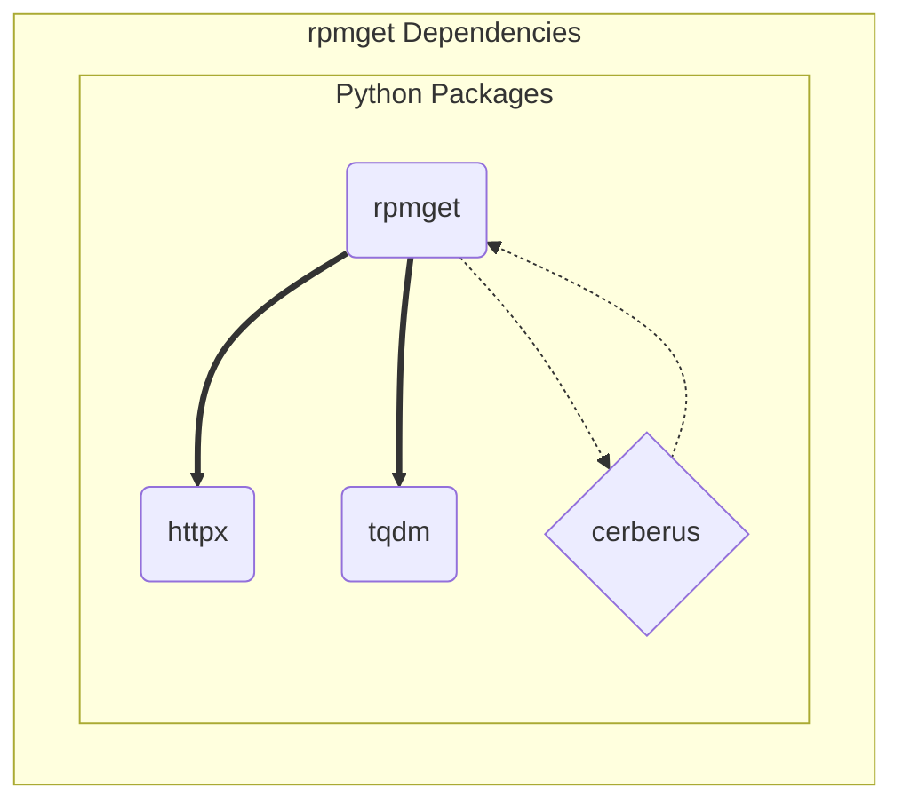

# Design Elements

The rpmget package provides a convenient baseline configuration and
example for managing an arbitrary set of binary rpm packages with
optional support for creating the canonical rpm build tree and pkg
repository.

## SW Dependencies

The primary runtime dependencies are httpx, tqdm, and cerberus,
where cerberus provides the runtime validation for the active user
configuration file. Complete package dependencies are shown in the
figure below:

```{figure} assets/rpmget_dependency_graph.svg
:width: 90 %
:align: center
:alt: rpmget software units

Rpmget Software Units (captured from mermaid to SVG or PNG).
```


<details>
  <summary>rpmget_dependency_graph source</summary>
  rpmget dependency graph showing primary software units.


</details>

## Design decisions

Higher-level API approach (httpx and tqdm) first, minimizing LoC where
possible. Maximize use of the ConfigParser ExtendedInterpolation and
custom validator.

* flexible ConfigParser configuration format
- baseline config file validation via argument
* httpx download client with progress display

Make sure self-test and user-initiated validation always tries to use
provided configuration first, before falling back to the builtin example.