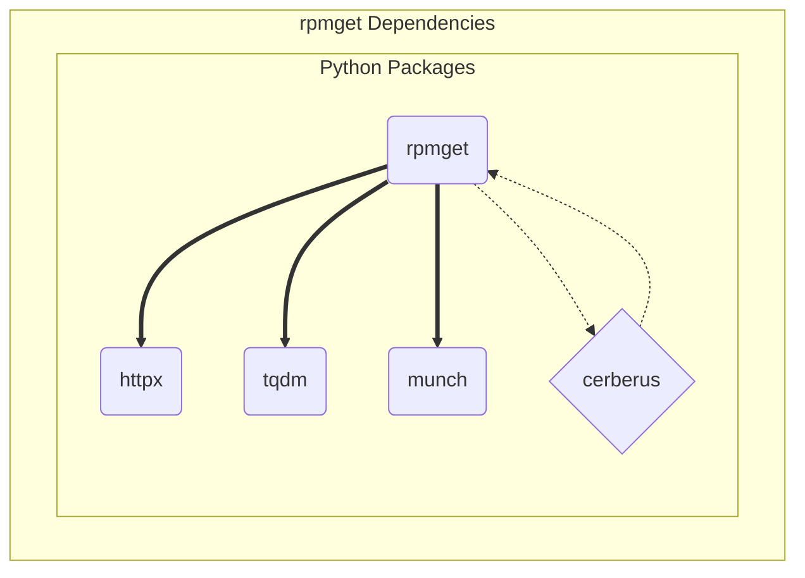

# Design Elements

The rpmget package provides a convenient baseline configuration and
example for managing an arbitrary set of binary rpm packages with
optional support for creating the canonical rpm build tree and pkg
repository.

The primary runtime dependencies are munch, httpx, tqdm, and cerberus,
where cerberus provides the runtime validation for the active user
configuration file. Complete package dependencies are shown in the
figure below:

```{figure} assets/rpmget_dependency_graph.svg
:width: 90 %
:align: center
:alt: rpmget software units

Rpmget Software Units (captured from mermaid to SVG or PNG).
```


<details>
  <summary>rpmget_dependency_graph source</summary>
  rpmget dependency graph showing primary software units.


</details>

## Design decisions

* flexible configuration format with baseline validation
* httpx download client with progress display